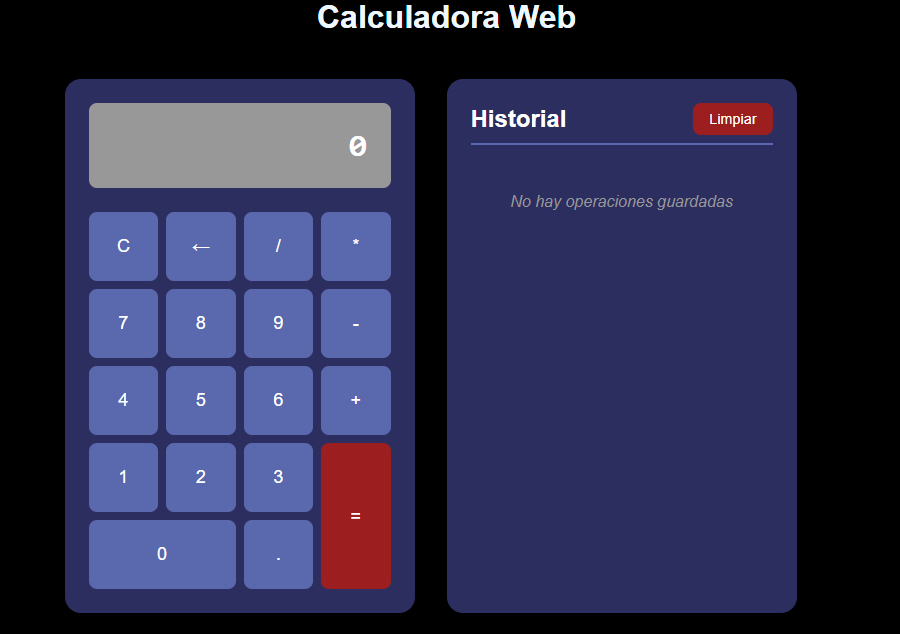
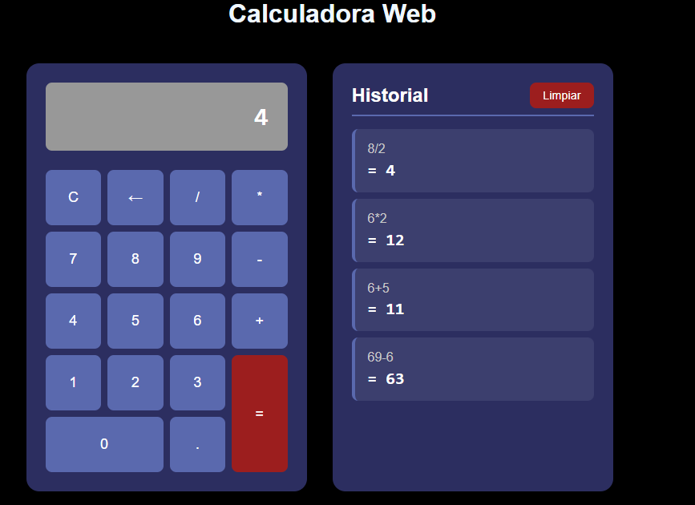

# Calculadora Web

Esta es la segunda asignacion de la asignatura Porgramacion.

En la cual se nos pide que realice una calculadora con HTML5 , JavaScript (ES5) adornada con CSS3, la cual hace las operaciones básicas de suma, resta, multiplicación y división, la cual tambien almacena un historial de los cálculos hechos hasta que el usuario decida eliminarlos.

Esta calculadora funciona de forma comun y corriente, cuando el usuario quiera eliminar el historial de operaciones solo debe de hacer click en el boton "Limpiar" y se le mostrar una alerta que dira "¿Estás seguro de que quieres eliminar todo el historial?" y dos opciones que diran "ok" "cancelar", si el usuario hace click en "ok" se eliminara el historial de operaciones y si el usuario hace click en "cancelar" no se eliminara el historial de operaciones.

**foto de la Calculadora Web**

